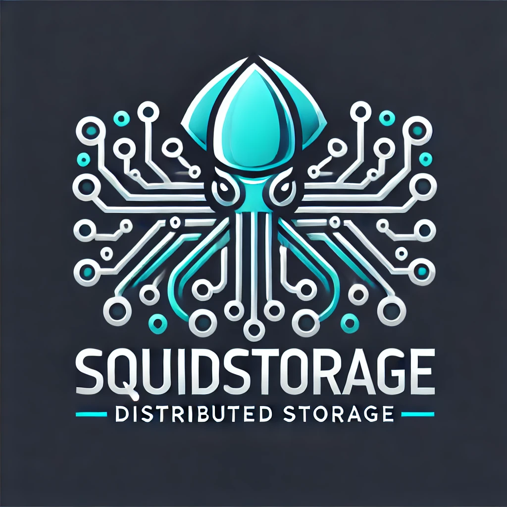

# Squid Storage

Squid Storage is a distributed storage system designed to manage file replication and consistency of a specific folder across multiple nodes. 
<br/>

## 1. Design
The key components are:

1. Server:
    * Acts as the central coordinator for managing file operations (e.g., create, read, update, delete).
    * Maintains metadata such as the dataNodeReplicationMap to track which datanodes hold replicas of each file.
    * Handles client requests and propagates file operations to datanodes and other clients.
    * Uses the ```select``` system call to await on all clients socket at the same time.

2. DataNode:
    * Stores file replicas and responds to requests from the server
    * Receives periodic heartbeats from the server as checks of its availability.
    * Receives file updates from clients through the server.

3. Client:
    * Provides a graphical interface for users to interact with the system (e.g., uploading or retrieving files).
    * Communicates with the server to perform operations.
    * Receives update from other clients through the server.


## 2. Replication and Fault Tolerance
The replication factor determines the number of datanodes that hold a copy of each file. A higher replication factor improves availability and fault tolerance but increases storage overhead.

The ```dataNodeReplicationMap``` ensures that each file is replicated across multiple datanodes and track for all files where it can be found. The ```rebalanceDatanode``` function dynamically assigns new datanodes to files when replication levels fall below the desired threshold.

At start, when a new clients connects to the server follows a predefined handshake behavior to create a second socket with the server. This is necessary to avoid message conflicts since both the client and the server have an active behavior.
Socket operations are configured with timeouts to prevent indefinite blocking. Failed operations are aborted in the server.

Heartbeats are used to detect datanode node failures or partitions, and the system dynamically rebalances file replicas to maintain the desidered redundancy.

Squid Storage uses a distributed file locking mechanism to ensure that at most one client at a time is writing a file, in order to avoid conccurrent writes, data corruption and conflicts.
Each operation of clients is propagated to other client and datanodes immediately, so that every component online hase the last version of the file. Each component that connects later is updated all at once.

Squid Storage ensures partition tolerance by maintaining active every component if when it has lost connection. In that case, client and datanodes tries to re-connect in loop with the server.
A client is able to modify files only when is connected to the server and it has acquired the lock for that file. If the client is disconnected, the files becomes view only, in order to avoid inconsistencies (prioritizing consistency over avaibility in this case).

## 3. Squid Protocol
The squid protocol is a text-based protocol designed to express operations on files or other messages like hearbeat, syncStatus and so on. 

Each message follows the format:
```
Keyword<ArgName1:Arg1, ArgName2:Arg2, ..., ArgNamen:Argn>
```

For example: 
```
UPDATE<filePath:/squistorage/example.txt>
```


The full set of messages is displayed below:

```
+---------------+---------------------------+------------------------------+
| Keyword       | Arguments                 | Response                     |
+---------------+---------------------------+------------------------------+
| CreateFile    | filePath                  | ACK                          |
| TransferFile  | filePath                  | ACK                          |
| ReadFile      | filePath                  | ACK                          |
| UpdateFile    | filePath                  | ACK                          |
| DeleteFile    | filePath                  | ACK                          |
| AcquireLock   | filePath                  | isLocked                     |
| ReleaseLock   | filePath                  | ACK                          |
| Heartbeat     | -                         | ACK                          |
| SyncStatus    | -                         | ACK (folderContent)          |
| Identify      | -                         | nodeType, processName        |
| Response      | ACK / nodeType,           | processName / lock           |
|               | processName / lock        |                              |
| Close         | -                         | ACK                          |
+---------------+---------------------------+------------------------------+
```

<div align="center">

</div>